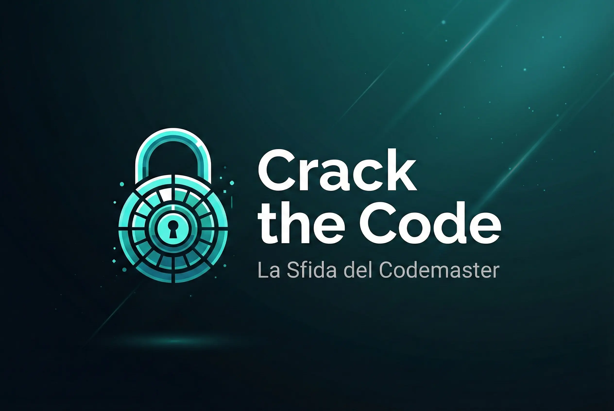

# Crack the Code: La Sfida del Codemaster



**Crack the Code** è un puzzle di deduzione numerica ispirato a **Mastermind**. Hai sette tentativi per ricostruire un codice composto da cifre uniche, usando indizi progressivamente meno espliciti.

**Live demo:** https://falker47.github.io/Crack-the-Code/

## Modalità

### Partita libera

Configura liberamente la sfida:

- lunghezza del codice: **4, 5 o 7 cifre**;
- feedback: **Completo, Sintetico o Criptico**;
- **7 tentativi** per trovare il codice.

Ogni combinazione usa uno scenario narrativo standalone.

### Campagna

La campagna contiene **9 livelli**, cioè tutte le combinazioni tra le tre lunghezze e i tre livelli di feedback.

La progressione parte da piccoli hack tra amici e cresce fino a sistemi sempre più importanti, collegati da un unico filo narrativo. I livelli si sbloccano in sequenza e il progresso viene salvato localmente nel browser tramite `localStorage`.

## Feedback

| Livello | Informazioni ricevute |
| --- | --- |
| **Completo** | Esito cifra per cifra: posizione corretta, presente altrove o assente |
| **Sintetico** | Solo i conteggi complessivi delle tre categorie |
| **Criptico** | Al massimo un'informazione parziale su una cifra rilevata, accompagnata da un indizio |

Il **Codemaster** è il personaggio/interfaccia narrativa che restituisce il feedback.

Nella fiction viene presentato come una mente digitale; il gioco, però, **non utilizza modelli AI, API esterne o servizi backend**. Tutta la logica gira localmente nel browser.

## Regole

- il codice segreto usa cifre **tutte diverse**;
- anche ogni tentativo deve usare cifre diverse;
- 🟢 = cifra corretta nella posizione corretta;
- 🟡 = cifra presente ma in posizione diversa;
- ⚪ = cifra assente;
- la barra **Appunti** permette di segnare manualmente cifre escluse o confermate;
- con feedback Completo, le cifre sicuramente assenti vengono escluse automaticamente dagli Appunti.

## Avvio locale

Non ci sono dipendenze runtime o build step.

```bash
git clone https://github.com/falker47/Crack-the-Code.git
cd Crack-the-Code
python -m http.server
```

Poi apri `http://localhost:8000`.

## Verifica

La CI controlla la sintassi JavaScript e la coerenza dei dati narrativi e della campagna:

```bash
node --check data.js
node --check script.js
node test/validate-data.mjs
```

## Struttura

```
├── index.html
├── style.css
├── script.js
├── data.js
├── crack-the-code.webp
└── test/
    └── validate-data.mjs
```

## Implementazione

- HTML5
- CSS3
- JavaScript Vanilla
- `localStorage` per il progresso della campagna
- nessun backend
- nessuna dipendenza runtime

## Autore

**Maurizio Falconi** — [falker47](https://github.com/falker47)

[Portfolio](https://falker47.github.io/Nexus-portfolio/)
